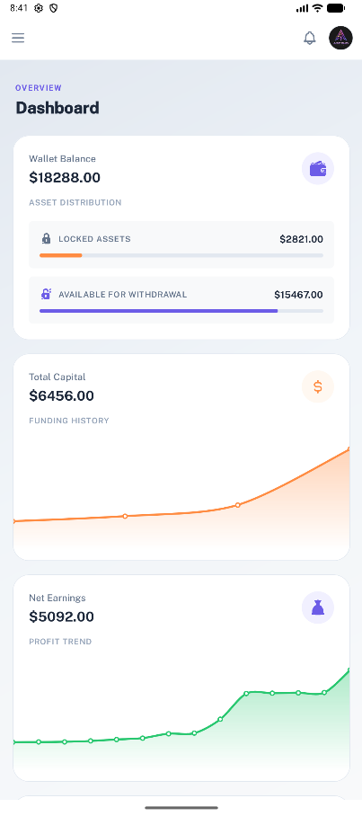
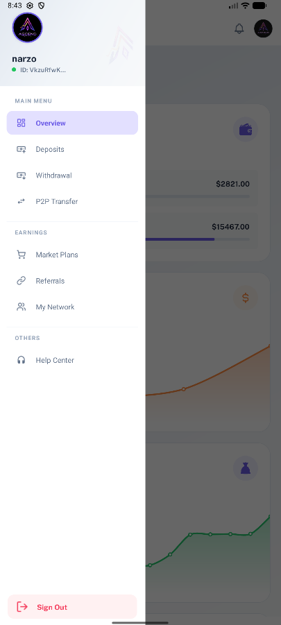
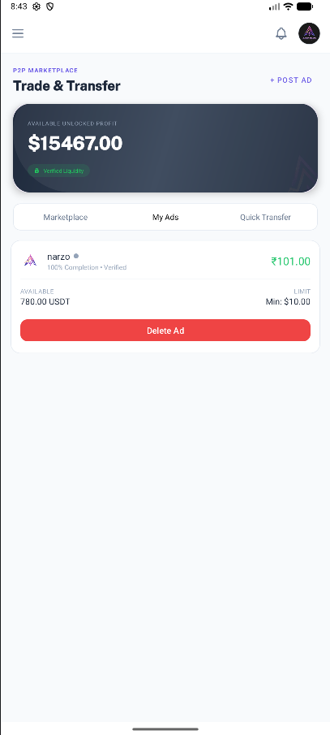
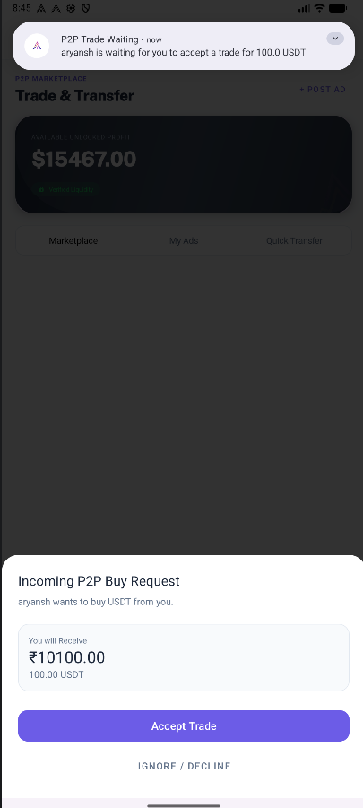
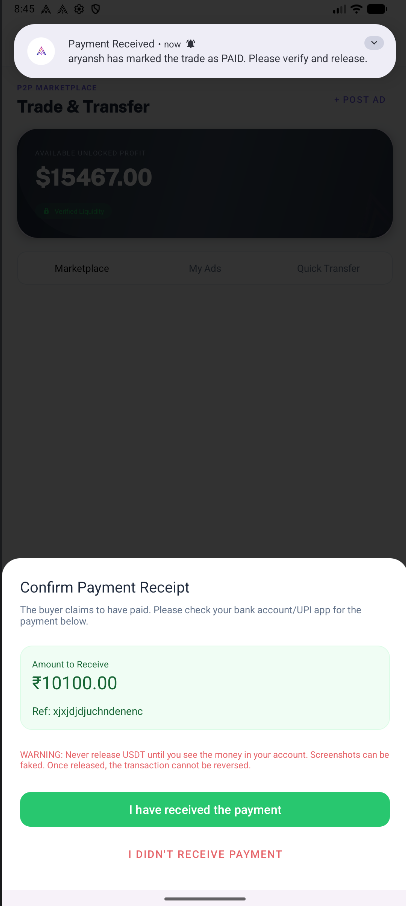
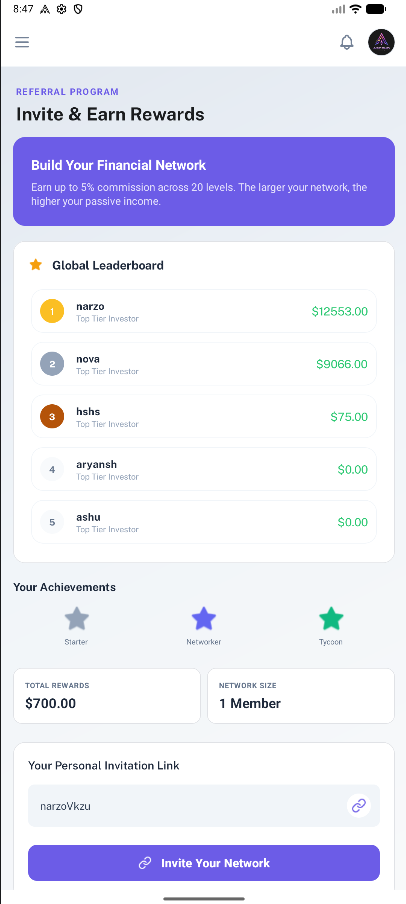
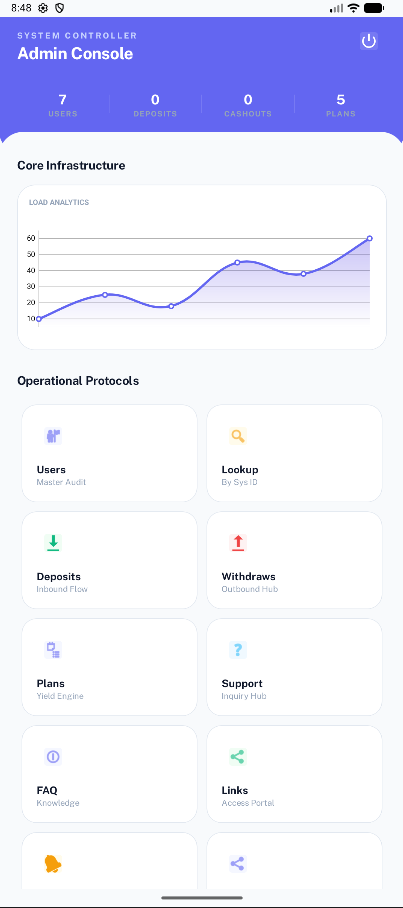
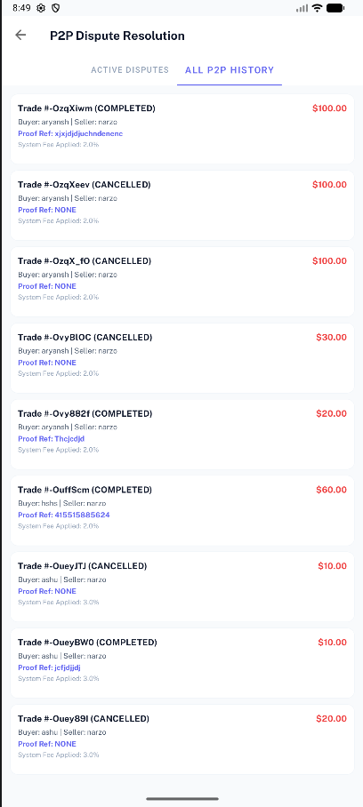

# Ascend Invest - Advanced P2P Investment & Trading Platform

[](https://developer.android.com)
[](https://firebase.google.com)
[](LICENSE)

**Ascend Invest** is a sophisticated fintech ecosystem designed to bridge the gap between traditional investment and decentralized peer-to-peer (P2P) trading. It provides a robust platform for users to manage investments, engage in direct asset transfers, and trade within a secure, real-time P2P marketplace.

---

## 🚀 Key Features

### 💎 Advanced P2P Marketplace
Experience a high-performance P2P trading engine that enables seamless asset exchange between users.
*   **Real-time Order Matching:** Automated listing and discovery of P2P trade offers.
*   **Secure Escrow System:** Built-in safeguards to ensure trust and transparency in every transaction.
*   **Integrated P2P Chat:** Encrypted, real-time communication between buyers and sellers to coordinate transfers directly within the app.
*   **Rating & Verification:** Community-driven trust metrics for secure trading environments.

### 💸 Direct Transfers & Wallet Management
*   **Instant Peer-to-Peer Transfers:** Send and receive funds/assets instantly using internal handles or QR codes.
*   **QR Integration:** Quick-scan functionality for error-free transactions.
*   **Transaction History:** Deep insights into every inflow and outflow with detailed status tracking.
*   **Wallet Security:** Advanced security managers to protect user assets and private data.

### 👥 Referral & Growth System
*   **Multi-tier Referrals:** Automated tracking of user invites and referral networks.
*   **Reward Incentives:** Real-time calculation and distribution of referral bonuses.
*   **Leaderboard & Stats:** Transparency for users to track their growth and earnings.

### 📈 Investment & Portfolio Management
*   **Dynamic Investment Plans:** Browse and subscribe to various investment tiers with real-time profit calculations.
*   **Live Market Data:** Interactive charts and visualizations powered by MPAndroidChart to track performance.
*   **Profit Distribution:** Automated background workers (WorkManager) for consistent and accurate profit payouts.

### 🛡️ Comprehensive Admin Suite
A dedicated module for administrators to maintain ecosystem health:
*   **User Oversight:** Complete management of user accounts, KYC, and security status.
*   **Market Regulation:** Monitor and moderate P2P listings and active chat sessions.
*   **Financial Control:** Review and approve/reject withdrawal and deposit requests.
*   **Content Management:** Update FAQs, announcements, and investment plan configurations on the fly.

### 📣 Community & Real-time Engagement
*   **Support Ticket System:** Integrated helpdesk for users to resolve issues directly with admins.
*   **Global Announcements:** Real-time push notifications and in-app banners for platform updates.
*   **In-app Chat:** Seamless communication channels within the P2P marketplace.

---

## 🛠️ Industry Workflow & Standards

This project is built following professional software development lifecycles (SDLC) used in top-tier tech companies:

*   **CI/CD Pipeline:** Integrated **GitHub Actions** for automated build verification and unit testing on every push.
*   **Modular Architecture:** Strict separation between Client (`app`), Administration (`admin`), and Web Landing (`website`) to ensure scalability and security.
*   **Background Lifecycle Management:** Uses **Android WorkManager** for deferrable, guaranteed background execution of financial logic (e.g., profit distribution).
*   **Modern State Management:** Implementation of **Material Design 3** and **Firebase Realtime Database** for live state synchronization and responsive UI.
*   **Encapsulated Logic:** Business logic is decoupled into specialized **Handler Classes** to maintain high readability and facilitate future unit testing.
*   **Relational vs. NoSQL Versatility:** Demonstrates proficiency in both **Firebase (Realtime DB)** for live mobile updates and **SQL (MySQL/Knex)** for structured web data.

---

## 🛠 Tech Stack

### Mobile (Android)
*   **Language:** Java
*   **UI Framework:** Material Design 3, XML Layouts.
*   **Architecture:** Modular Handler-based Architecture.
*   **Services:** Firebase Auth, Realtime Database, Cloud Messaging.
*   **Processing:** WorkManager for automated profit cycles and order matching.
*   **Utilities:** MPAndroidChart, ZXing (QR Scanning).

### Web (Fullstack)
*   **Frontend:** React (TypeScript), Lucide Icons, Tailwind CSS, Framer Motion.
*   **Analytics:** ApexCharts, Recharts.
*   **Server:** Node.js, Express, JWT Authentication, Socket.io.
*   **Persistence:** MySQL / MariaDB / SQLite via Knex.

---

## 📂 Project Structure

The project is divided into three primary modules:

*   `app/`: The client-facing application where users trade, invest, and manage their wallets.
*   `admin/`: The internal management tool for platform operators to handle support, transactions, and system settings.
*   `website/`: A React-based landing page and dashboard featuring a specialized SQL-based backend.

---

## 🌐 Web Implementation (Preview)

The project includes a high-availability web platform built for scalability and performance:
*   **Frontend:** React 18, TypeScript, Tailwind CSS, Framer Motion (Animations).
*   **Data Visualization:** ApexCharts & Recharts for advanced financial analytics.
*   **Backend:** Express.js with Knex.js Query Builder.
*   **Database:** SQL-based storage (MySQL/SQLite) for relational integrity for web, NoSQL-based Firebase for application.
*   **Real-time:** Socket.io for live updates and instant messaging synchronization.

---

## 📸 Screenshots

### User Application
| Dashboard | Navigation | P2P Marketplace |
| :---: | :---: | :---: |
|  |  |  |

| P2P Trade Request | Payment Confirmation | Referral System |
| :---: | :---: | :---: |
|  |  |  |

### Admin Console
| System Controller | Dispute Resolution |
| :---: | :---: |
|  |  |

---

## ⚙️ Getting Started

### Prerequisites
*   Android Studio Ladybug or later.
*   JDK 11+
*   A Firebase project with `google-services.json` placed in both `app/` and `admin/` folders.

### Installation
1.  Clone the repository:
    ```bash
    git clone https://github.com/expectation-narzo/AscendInvest.git
    ```
2.  Open the project in Android Studio.
3.  Sync Gradle and ensure all dependencies are resolved.
4.  Configure your Firebase credentials in the console.
5.  Build and Run.

---

## 🗺️ Project Roadmap
- [ ] **Phase 1:** Launch Beta for Android & Web.
- [ ] **Phase 2:** Implement AI-based Trade Fraud Detection.
- [ ] **Phase 3:** Integration with major Crypto Wallets (Metamask/TrustWallet).
- [ ] **Phase 4:** Expand Investment Plans to include Real-World Assets (RWA).

## 🤝 Contributing
Contributions are what make the open source community such an amazing place to learn, inspire, and create. Any contributions you make are **greatly appreciated**. Please see [CONTRIBUTING.md](CONTRIBUTING.md) for details.

## 🛡️ Security
For information on security reporting, please see [SECURITY.md](SECURITY.md).

## 📄 License

This project is licensed under the MIT License - see the [LICENSE](LICENSE) file for details.

---

Developed with ❤️ by [Exp Narzo](https://www.linkedin.com/in/expectation-narzo).
